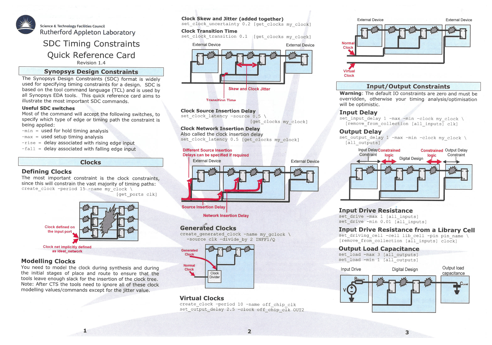
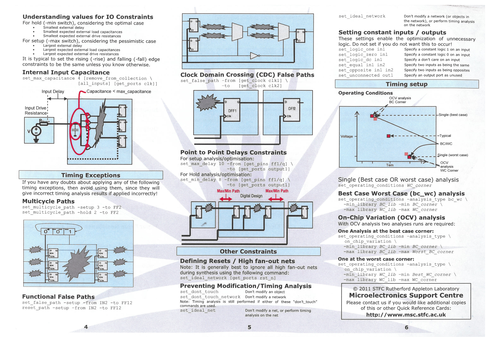

# Digital Design Flow - Everything you should know

This is my personal digital implementation flow with notes and comments that can provide some tips and tricks that I should be aware of.

This will be updated onward if I encounter something new.

Roughly, this "cheat sheet" will be divided into the following parts:

+ Synthesis
+ PnR
+ Verification


## Synthesis

For Cadence tool set, synthesis is done by Genus. And to do synthesis, the minimal files needed include:

+ Behavioural Verilog (.v)
+ Standard cell liberty files (.lib)
+ Macro liberty files (if used)
+ Design constraint file (.sdc)
+ OPTIONAL: tcl script for batch mode (.tcl)
+ OPTIONAL: Abstract file of used cells (.lef)

Quick reference for SDC constraint:





An example of minimal constraint SDC file:

```tcl
##############################################################
# * Minimal sdc file
##############################################################


## defining all clocks
## latency should be a realistic number, depending on clock fanout
## this number will be used in P&R tool for constraining the clock tree
## synthesis
## setup uncertainty should be around 10% of clock period or larger but max
## 5ns should do for low speed designs

create_clock -name CLK -period 25 -waveform {0 12.50} [get_ports clk]

# estimated clock edge transition
set_clock_transition 0.15 [get_clocks CLK]

# pre-CTS clock uncertainty (jitter + skew estimate)
set_clock_uncertainty 0.20 [get_clocks CLK]


## timing of the IO signals
## half way between the active clock edges is usually “the safe way”
## this has to be adapted to the required IO timing of course!
##################################################
# Input constraints
##################################################

# exclude clock and reset from generic input constraints
set DATA_INPUTS [remove_from_collection \
                    [all_inputs] \
                    [get_ports {clk rst_n}]]

# upstream logic delay assumptions
set_input_delay 3.0 -max -clock CLK $DATA_INPUTS
set_input_delay 0.5 -min -clock CLK $DATA_INPUTS


##################################################
# Output constraints
##################################################

# assume downstream logic needs part of cycle
set_output_delay 3.0 -max -clock CLK [all_outputs]
set_output_delay 0.5 -min -clock CLK [all_outputs]

##################################################
# Input driver model
##################################################

# approximate driving strength of upstream logic
set_driving_cell \
    -lib_cell BUF1 \
    $DATA_INPUTS

## environment of the IO signals
## assuming a weak driver from outside and a reasonable load (0.4 pf is
## approx.. 2 mm of wiring in 180nm). Here you should model the environment
## of your block if you know better

##################################################
# Output load model
##################################################

# estimated load capacitance for downstream logic
set_load 0.05 [all_outputs]

##################################################
# Signal integrity / optimization guardrails
##################################################

# limit fanout to prevent unrealistic nets
set_max_fanout 12 [current_design]

# limit transition for synthesis estimation
set_max_transition 0.40 [current_design]

# limit net capacitance
set_max_capacitance 0.25 [current_design]

## prohibiting the synthesis of buffer trees for some signals
set_false_path -from [get_ports rst_n]

```

The constraint's mainly 3 aspects are:

+ Clock
+ Input constraint
+ Output constraint


#### General flow

Generally, synthesis flow should follow the following sequences:

+ Set project-wise variables
+ Set default search paths
+ Read standard cell libraries
+ Read verilog
+ Elaborate
+ Read design constraints and check timing intent
+ Generic synthesis
+ Mapping synthesis
+ Optimisation synthesis
+ Output results

**1. Set project-wise variables**

This includes some useful variables that could be used later on.

For example:

```tcl 
set LOCAL_DIR "[exec pwd]/.."
set SYNTH_DIR  "${LOCAL_DIR}/syn"
set TCL_PATH   "${LOCAL_DIR}/tcl"
set SDC_path   "${LOCAL_DIR}/syn"
set REPORTS_PATH   "${LOCAL_DIR}/syn/reports"
set PDK_PATH    "/eda/design_kits/UMC180/BE_Faraday/source/fsa0a_c"
set LIB_PATH    "/eda/design_kits/UMC180/BE_Faraday/source/fsa0a_c/2021Q2v1.0/GENERIC_CORE/FrontEnd/synopsys/synthesis\
 /eda/design_kits/UMC180/BE_Faraday/source/fsa0a_c/2021Q2v1.0/GENERIC_CORE/BackEnd/lef"
set RTL_PATH    "${LOCAL_DIR}/rtl"
set DESIGN "Row_encoder_5P_plus"
set LIB_LIST { 
fsa0a_c_generic_core_ss1p62v125c.lib.gz 
}
set TECH_LEF_LIST { 
header6_V55.lef
}
set   { 
fsa0a_c_generic_core.lef
}
set LEF_ANT_LIST {
FSA0A_C_GENERIC_CORE_ANT_V55.6.lef
}
set LEF_LIST [concat $TECH_LEF_LIST $LEF_CELL_LIST ]

set RTL_LIST {
Row_encoder_5P+_v01.v

}
```


**2. Set default search paths**

This will set the default search paths and some attribute:

```tcl
set_db hdl_track_filename_row_col true
set_db lp_power_unit mW

## liberty search path
set_db init_lib_search_path $LIB_PATH

## Script search path
set_db script_search_path $TCL_PATH

## RTL search path
set_db init_hdl_search_path $RTL_PATH


set_db error_on_lib_lef_pin_inconsistency true

```


**3. Read standard cell libraries**

Read the liberty files for standard cells, physical lef cells can also be read, but this is optional


```tcl
read_libs $LIB_LIST
read_physical -lef $LEF_LIST

```


**4. Read verilog**


Read the drafted verilog

There are some options that might be useful while reading in our verilog:

```tcl
read_hdl -sv $RTL_LIST
```

The usage of read_hdl includes:

```
read_hdl file_list
[-language {v2001 | v1995 | sv | vhdl }]
[-library library_name[=library_name2]...] 
[-netlist] [-f filename]
[-define macro=value]... file_list.....
```

One very useful option is **-define**, it can make the compiler choose how to elaborate the design.

example:

```tcl
read_hdl -define "A B=4 C" example.v
read_hdl -define A -define B=4 -define C ...
```


**5. Elaborate**

After reading the verilog file, if lucky and no syntax errors were detected. Elaboration can be done.

Simply use the command:

```
elaborate
```

The usage of elaborate includes:

```
elaborate [-parameters string] [module]... 
[-lib_path path]... [-lib_extension extension]...

```

The useful and critical usage is using parameters.

Following examples show how to use parameters:


The following example shows a sized integer specification. In this case, 6 is the size (number of bits), d the format (decimal), and 43 the value.
```
elaborate -parameters {6’d43}
```

You can specify a parameter positionally, as an integer in the parameter list, or by name, as a two-element Tcl list. The first element is the name and the second element is the value. For example, you can do either:
```
elaborate -param {5 10}
elaborate -parameters {{width 5} {depth 10}}
```

The following example shows the specification of parameters for submodules or interface instances:
```
elaborate -parameters {{b2.m 0} {b1.w 7’d111}} 
```


**6. Read design constraints and check timing intent**


This is very simple just use the following command:

```tcl
read_sdc file
check_timing_intent
```


**7. Generic synthesis**

```tcl
syn_generic
```


**8. Mapping synthesis**

```tcl
syn_map
```


**9. Optimisation synthesis**

```tcl
syn_opt
```


**10. Output results**

Before exporting results, you can check the PPA of the design with the following:

+ To generate a detailed area report, use **report_area**.
+ To generate a detailed gate selection and area report, use **report_gates**.
+ To generate a detailed timing report, including the worst critical path of the current design, use **report_timing**.


In any stage of synthesis, you can also write the whole data base so that you do not have to start all over again:

```
write_db ABC.db

```


And normally, you might want the following files to be exported:

```
write_hdl > ./outputs/Row_encoder_5P+_v01_syn.v
write_sdc > ./outputs/Row_encoder_5P+_v01_syn.sdc
write_sdf -nonegchecks -edges check_edge -timescale ns -recrem split -setuphold split > ./outputs/Row_encoder_5P+_v01_syn_delay.sdf

```


Additionally, if one wishes to have the scan def file (dft flow), following command should be used:

```
write_scandef > ..../top_design.scandef
```


#### Design For Test Flow


On top of generic flow, design for testability flow exists to include scan chains, built-in self test, boundary scan...etc.

The most common one is the internal scan chain insertion.

The differences start after reading hdl and constraints and other constraints like fan-in fan-out, timing arcs etc.

DFT steps:

1. Select the scan style for the design:

```tcl

set_db dft_scan_style {muxed_scan|clocked_lssd_scan}
```


2. As for most commonly used mux style, specify the pin or port which drives the shift-enable pins of all the scan-flops:

```tcl
define_test_signal -function shift_enable ... [-default_shift_enable]
```


```
define_test_signal {port|hport|pin|hpin}
-function string [-index integer] [-name string] 
[-active {high|low}] [-ideal] [-scan_shift] 
[ [-hookup_pin {pin|hpin} [-hookup_polarity string]]
  [-cfg_pad {tm_signal|se_signal}] 
| [-create_port | -shared_input | -shared_output| -test_only] ]
[-default_shift_enable]
[-wir_signal  [-wir_reset_value {low|high}]
  [-wir_tm_value {low|high}] ]
[-pipeline_depth integer]
[-lec_value {auto | 0 | 1 | no_value }]
[-port_bus {port|port_bus|hport_bus}]
[-multi_mode] [-design design]
```


or use this one:

```tcl
define_shift_enable -name SE -active high -create_port SE
```

```
define_shift_enable [-name name] -active {low|high}
[-default] [-ideal] 
[ [-hookup_pin {pin|hpin} [-hookup_polarity string]] 
  [-cfg_pad {tm_signal|se_signal}] 
| -create_port ]
[-lec_value {auto | 0 | 1 | no_value }]
{port|pin|hpin} [-design design]
```


3. Some instances can be marked as "PLEASE DO NOT MAP TO SCAN CELLS" using the following command:


```tcl
set_db inst:topDesign/inst .dft_dont_scan true
set_db hinst:topDesign/inst .dft_dont_scan true 
set_db module:topDesign/module .dft_dont_scan true 
set_db design:topDesign .dft_dont_scan true 
```


4. For muxed scan, a test clock should be defined:


```tcl
define_test_clock -period ...

```


Before actually synthesising the DFT-version of the design, DFT rule check needs to be done with a simple command:

```tcl
check_dft_rules
```

Report the scannable status of the flops:

```tcl
report_scan_registers
```


Check for remaining dft violations:

```tcl

report_dft_violations
```


And fixing them...

```tcl
fix_dft_violations -violations vid_0_async -test_control SE
```


After fixing all the violations, one may want to configure the DFT constraints etc.


Specify the minimum number of scan chains to be created:

```tcl
set_db [current_design] .dft_min_number_of_scan_chains integer
```


Specify whether to allow mixing of rising and falling edge-triggered scan flip-flops from the same test-clock domain in the same scan chain:

```tcl
set_db [current_design] .dft_mix_clock_edges_in_scan_chains {true | false}
```


Maybe also give scan cells a prefix... for distinguishing them out

```tcl
set_db dft_prefix DFT_

```


Define the top-level scan chains:

```tcl
define_scan_chain -name one_and_only_chain -sdi scan_in -sdo scan_out -create_ports
```


```
define_scan_chain [-name name]
{-sdi {hport|port|pin|hpin} -sdo {hport|port|pin|hpin} [-create_ports] [-shared_input]
  {-shared_output [-shared_select test_signal] | 
   -non_shared_output}
 [-hookup_pin_sdi {pin|hpin}] [-hookup_pin_sdo {pin|hpin}]
 [-shift_enable test_signal] 
 [-head segment] [-tail segment] [-body segment]
 [-complete | -max_length integer] 
 [-domain test_clock_domain [-edge {rise|fall}]] 
 [-terminal_lockup {level_sensitive|edge_sensitive}]
 [-cfg_pad {tm_signal | se_signal} ]
|-analyze -sdo sdo [-sdi sdi] [-dont_overlay]
  {-shared_output  | -non_shared_out} }
```


Preview the scan connection:

```tcl
connect_scan_chains -preview -auto_create_chains [-pack] 
```


5. Connect scan Chains

```tcl
connect_scan_chains [-auto_create_chains]
```


6. Run incremental optimisation

Fix the timing impact this may have brought:

```tcl
syn_opt [-incremental]
```


#### Exclude scan cells

Sometimes, the synthesis tool will generate the netlist with scan-able registers/flops to optimise QoR.

The following global attribute should be turned off so that synthesis tool will not use these cells:

```tcl
set_db use_scan_seqs_for_non_dft false
```


## PnR


### Block-level implementation

### Hierarchical implementation

Top-down methodology is preferred, but bottom-up can also be done, just more steps.

LEF generation is needed for submodules with the command:

write_lef_abstract 

To include the antenna information for the submodule, antenna checking for the submodule is needed before export the lef.

## Verification

### DRC

### LVS